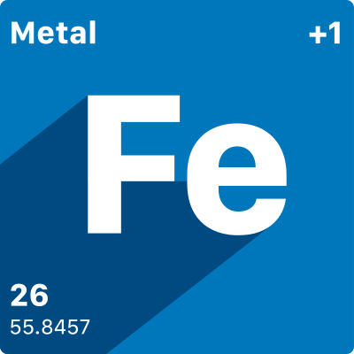

# Project IronCore

Project IronCore is an open source system for managing compute and storage workloads across multiple providers.

The Project IronCore API is a declarative API, built on top of Kubernetes' API Machinery as an aggregated API server. 
The API does not have any tight coupling to Kubernetes core container workloads.

“Project IronCore” is focused on a Kubernetes driven IaaS and is neither affiliated or sponsored by “IronCore Labs” nor 
related to its GitHub page, nor its content under https://github.com/IronCoreLabs.

## To start developing Project IronCore

> ⚠️ Before contributing, make sure you read the [contribution guidelines](docs/development/contribution.md)

Please see our documentation in the `/docs` folder for more details.

## Contributing

We'd love to get feedback from you. Please report bugs, suggestions or post questions by opening a GitHub issue.

## Licensing

Copyright 2025 SAP SE or an SAP affiliate company and IronCore contributors. Please see our [LICENSE](LICENSE) for
copyright and license information. Detailed information including third-party components and their licensing/copyright
information is available [via the REUSE tool](https://api.reuse.software/info/github.com/ironcore-dev/ironcore).
