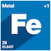

# onmetal-api

onmetal-api is an open source system for managing compute and storage workloads across multiple
providers.

The onmetal-api API is a declarative API, built on top of Kubernetes' API Machinery as an
aggregated API server. The API does not have any tight coupling to Kubernetes core
container workloads.

## To start developing onmetal-api

> ⚠️ Before contributing, make sure you read the [contribution guidelines](docs/development/contribution.md)

Please see our documentation in the `/docs` folder for more details.

## Contributing

We'd love to get feedback from you. Please report bugs, suggestions or post questions by opening a GitHub issue.

## License

[Apache-2.0](LICENSE)
