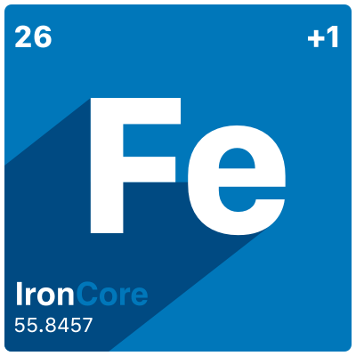

# onmetal-api

This project contains the _CustomResourceDefinitions_ and controller for the user-facing API of the Gardener 
on Metal project. It is meant to be a Kubernetes based Infrastructure-as-a-Service front-end of the OnMetal 
project.

## Start using or developing onmetal-api locally

Please see our documentation in the `/docs` folder for more details.

## Feedback and Support

Feedback and contributions are always welcome!

Please report bugs, suggestions or post questions by opening a [Github issue](https://github.com/onmetal/onmetal-api/issues).
