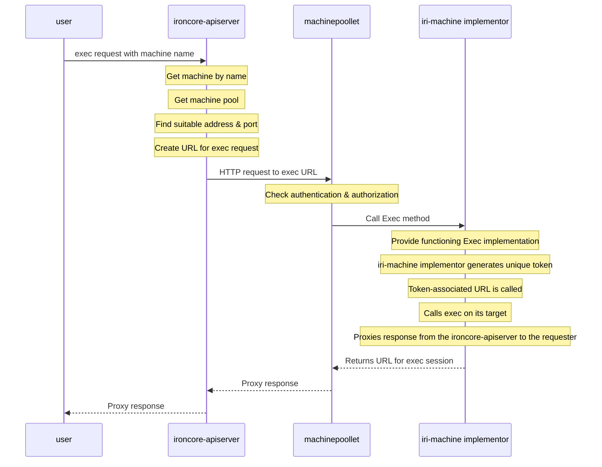

# Machine Exec

The `exec` feature allows accessing the serial console of a
`compute.Machine` via the `ironcore-apiserver`.
The following parties are involved in implementing `exec`:

* `ironcore-apiserver`
* `machinepoollet`
* `iri-machine` implementor

The connection flow between those components looks like the following:



## `ironcore-apiserver`

The `ironcore-apiserver` implements `exec` as a custom subresource
on the `Machine` resource. In the `ironcore` REST registry,
it is registered as `machines/exec`.

The subresource itself is implemented by implementing the
`k8s.io/apiserver/pkg/registry/rest.Connecter` interface, which
allows custom logic for handling `CONNECT` and their follow-up
`GET` / `POST` requests.

For `exec`, the `ironcore-apiserver` knows the name of the machine
the user wants to access. It first gets the machine by its name
(returning an error if it doesn't exist) and then the machine pool
it's assigned to (also returning an error if the machine is
not assigned to any pool or the machine pool does not exist).

On the machine pool, it looks for a suitable address via the reported
`MachinePool.Status.Addresses`, depending on the configurable preferred
address types of the `ironcore-apiserver`. Once found, it uses the
address together with the
`MachinePool.Status.DaemonEndpoints.MachinepoolletEndpoint.Port` to
create a URL to make the target `exec` request to. The URL is of the
form

```
https://<host>:<port>/apis/compute.ironcore.dev/namespaces/<namespace>/machines/<machine/exec
```

It then makes an http request to that location and proxies the
resulting response to the original requester.

## `machinepoollet`

The `machinepoollet` provides the HTTP server wrapping the
`iri-machine` implementor. This HTTP server also provides the
aforementioned route to serve `exec` for a machine.

When the `machinepoollet` gets a request to that URL it first
checks whether the requesting entity is authenticated & authorized
to do an `exec` request for that machine. It does so by using a
delegated authenticator / authorizer against the `kube-apiserver`
the `ironcore-apiserver` is connected to.

Once successfully authenticated & authorized, the `machinepoollet`
calls the `Exec` method of the `iri-machine` implementor. This
`Exec` method returns a URL where the `exec` session for the target
machine will be hosted at.

It then makes an HTTP request to that URL and proxies the resulting
response to the `ironcore-apiserver`.

## `iri-machine` Implementor

The `iri-machine` implementor has to provide a functioning `Exec`
implementation that returns the URL where the actual `exec` session
of the machine is hosted at.

For the `machinebroker`, this is implemented by having an HTTP
server that associates the request together with a unique randomly
generated token and returns a URL containing that token.

Once the URL containing that token is called, the `machinebroker`
looks up the corresponding request and calls `exec` on its target
(different from the original) `ironcore-apiserver` with the machine
namespace and name from the stored request. It then proxies the
response from the `ironcore-apiserver` to the requester.
