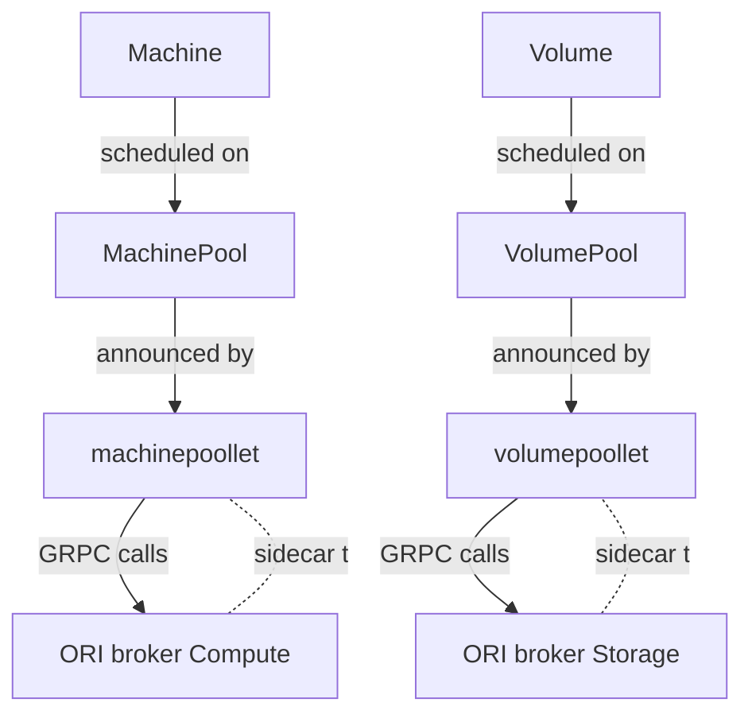

# ORI - Onmetal Runtime Interface

## Introduction

The `onmetal-api` project provides a control plane for Infrastructure as a
Service (IaaS), implementing Kubernetes API machinery. The project introduces
the concept of Pools, logical abstractions of provider-specific implementations
for resources such as Compute and Storage.

## Poollets and Resource Announcements

Poollets in the `onmetal-api` project are essential components responsible for
managing and announcing the availability of resource pools, such as
`MachinePool` and `VolumePool`.

### Announcing Availability

Upon initialization or when there's a change in available resources, poollets
announce the availability of resources, detailing their capacity and
capabilities:

- `machinepoollet`: Announces the availability and capacity of compute
  resources within a `MachinePool`.

- `volumepoollet`: Announces the availability and capacity of storage
  resources within a `VolumePool`.

This announced data provides clients with accurate and timely information
about resource availability, enabling them to make informed decisions when
requesting resources.

### Resource Collection and Dependency Resolution

When there's a request for resource provisioning:

1. `machinepoollet`: Before creating a new machine instance, it collects all
   necessary resources and dependencies. This includes gathering all network
   interfaces that the machine would need for communication and connectivity. It
   also identifies and reserves storage volumes that need to be attached to the
   machine.

2. `volumepoollet`: When provisioning storage, it identifies and reserves
   necessary storage classes and any dependent resources to ensure the volume
   meets the requested specifications.

By collecting resources and resolving dependencies, poollets ensure a seamless
resource provisioning process. They manage complexities behind the scenes,
ensuring that the users or services requesting resources get them in the
required state and configuration.

## Brokers

A `broker` represents a specific implementation of resources managed by
a Pool. The implementation details of the `broker` depend on the type of
resource it handles, such as Compute or Storage resources.

## Onmetal Runtime Interface (ORI)

The Onmetal Runtime Interface (ORI) is a GRPC-based abstraction layer
introduced to ease the implementation of a Pool Provider. The ORI ensures the
correct creation and management of resources handled by a Pool provider. An
implementer of the ORI should follow the interface defined in the
[ORI APIs](https://github.com/onmetal/onmetal-api/tree/main/ori/apis). The ORI
can be run as a sidecar to specific Poollets, such as `machinepoollet` or
`volumepoollet`, which gather all the necessary resources and information for
the GRPC calls.

## Interface Methods

The ORI defines several interface methods categorized into Compute, Storage,
and Bucket.

### Compute Methods

- Version
- ListMachines
- CreateMachine
- DeleteMachine
- UpdateMachineAnnotations
- UpdateMachinePower
- AttachNetworkInterface
- DetachNetworkInterface

### Storage Methods

- ListVolumes
- CreateVolume
- ExpandVolume
- DeleteVolume
- ListVolumeClasses
- AttachVolume
- DetachVolume

The ORI definition can be extended in the future with new resource groups.

## Diagram

Below is a diagram illustrating the relationship between Poollets,
ORI, and Pool Providers in the `onmetal-api` project.

This diagram illustrates:

- `Machine` resources are scheduled on a `MachinePool` which is announced by the `machinepoollet`.
- Similarly, `Volume` resources are scheduled on a `VolumePool` which is announced by the `volumepoollet`.
- The `machinepoollet` and `volumepoollet` each have an ORI `broker` sidecar, which provides a GRPC interface for 
making calls to create, update, or delete resources.
- The ORI `broker` (Compute) is a sidecar to the `machinepoollet` and the ORI `broker` (Storage) is a sidecar to the 
`volumepoollet`. They handle GRPC calls from their respective `poollets` and interact with the actual resources.
